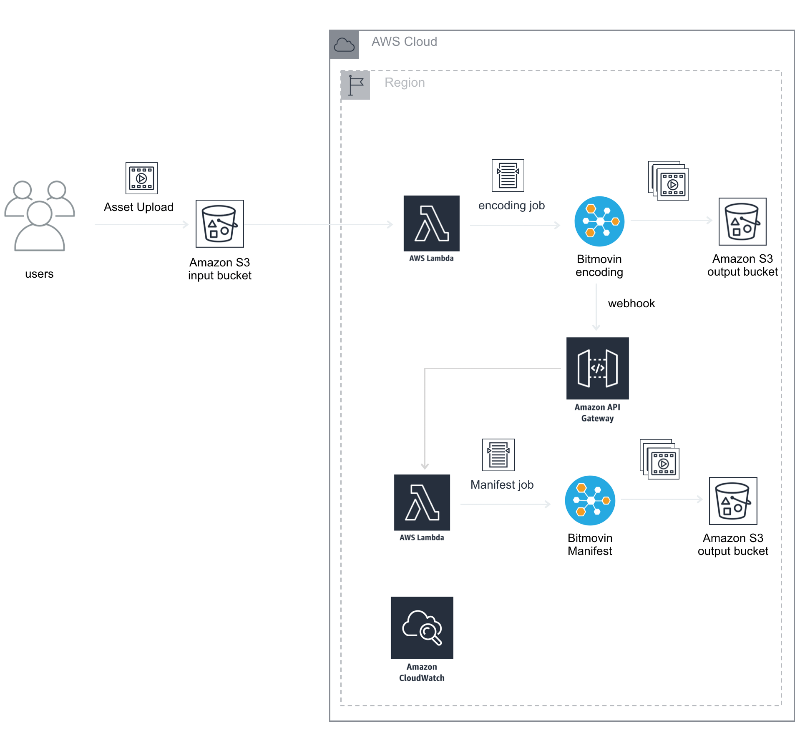
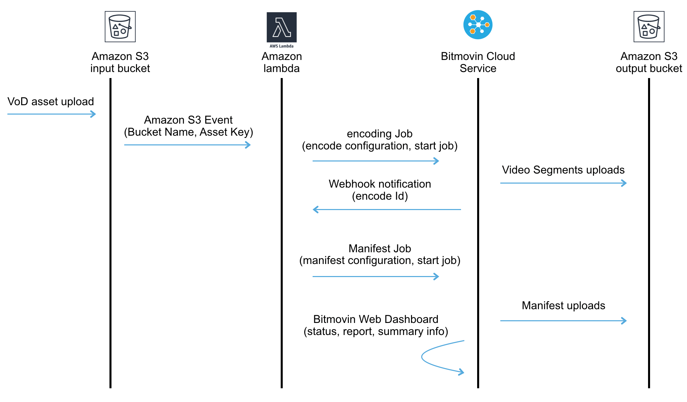

# AWS Lambda Simple Watchfolder Example

This document describes a watch-folder implementation in Java that enables a simple VoD encode workflow by detecting when a file is uploaded into an AWS S3 bucket and then executing the encode job and finally creating the manifest files. The Java project in this tutorial contains all the dependencies and plugins needed from AWS and Bitmovin to get you started quickly. The encode and manifest configuration in this example project are generic for a full HD encoding into four h.264 video profiles, one audio AAC and a DASH manifest. But, the encoding and manifest configuration can be changed to accommodate any of the capabilities and features that Bitmovin product supports, such as three-pass encode, per-title, GOP structure and much more.  

Below we show the high-level solution diagram, which consists of Bitmovin Cloud Encoding Service, Bitmovin Java API Client, two AWS Lambda functions and two AWS S3 buckets. 





### Sequence of events:

1. User uploads VoD assets into an input S3 bucket 
2. AWS Lambda function catches the S3 put events
3. AWS Lambda function process the event, which contains s3 input bucket name and asset key 
4. AWS Lambda function sends encoding job to Bitmovin Cloud Service
5. Bitmovin’s Cloud Service send a webhook post containing the encode ID  to AWS API Gateway, which sends the manifest job to Bitmovin.
6. AWS Lambda logs are stored in Amazon CloudWatch Logs 




### Project structure

```
├── pom.xml
├── readme.md
├── src
├── pom.xml
├── readme.md
├── src
│   ├── main
│   │   ├── java
│   │   │   ├── encode
│   │   │   │   ├── EncoderManager.java
│   │   │   │   └── LambdaEncode.java
│   │   │   └── manifest
│   │   │       ├── LambdaManifest.java
│   │   │       └── ManifestManager.java

```

1. encoding.EncoderManager: This class contains Bitmovin’s encode job configuration (Creates and starts the job), including the webhook configuration required to trigger the manifest job when the encode finishes. The encode configuration job encodes video in h.264, audio in AAC and creates 4 profiles (240p @ 400kbps, 480p @ 800kbps, 720p @ 4000kbps, 1080p @ 6500kbps) fragmented in fMP4 containers. This configuration can be changed to accommodate your specific encoding needs, for example, changing video bitrates, codec (AV1, VP9, h264, h265), GOP structure, color scheme, encryption and much more. You can use and adapt different configuration examples that we have available in Bitmovin’s Java repository here to guide you in the process. And, [here](https://bitmovin.com/docs/encoding) there is more information about Bitmovin encoding features.

2. encoding.LambdaEncode: This class contains the handleRequest method needed to configure the `watchfolder-java-encode` lambda function. It receives S3’s ObjectCreated events and calls `handleRequest` method of `encoding.EncoderManager` class to create and start the encoding job.

3. package.ManifestManager: This class contains Bitmovin’s manifest job configuration (Creates and starts the job). The manifest job creates a DASH manifest for the encoded and fMP4 fragments encoded previously. This configuration can be changed to accommodate your specific manifest needs, for example, adding HLS, additional audio adaptations, etc. You can use and adapt different configuration examples that we have available in Bitmovin’s Java repository [here](https://github.com/bitmovin/bitmovin-java) to guide you in the process. 

4. package.LambdaManifest: This class contains the `handleRequest` method needed to configure the `watchfolder-java-manifest` lambda function. It receives webhook post notifications thru the API Gateway interface and calls `handleRequest` method of `package.ManifestManager` class to create and start the manifest job.


### How to configure the bitmovinSimpleWatchfolder project and deploy it in AWS


#### High-level steps:

1. Create an AWS IAM Role
2. Create the `watchfolder-java-manifest` lambda function in AWS
3. Create the `watchfolder-java-encode` lambda function in AWS
4. Update variables in project class `EncoderManager` 
5. Update variables in project class `PackagerManager` 
6. Build and package the project
7. Upload the JAR file to the lambda functions

#### Deployment Tutorial

Bitmovin will release soon a detailed AWS Lambda Watchfolder deployment tutorial with step by step AWS environment setup


